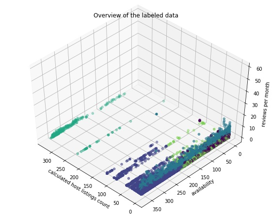

# Airbnb-NYC_Customer-Segmentation
Use the K-means algorithm to partition the databse of Airbnb users in New York City and identify suspicious users

# Introduction

The goal of this project is to identify the characteristics of the different groups of users that rent Airbnbs in New York City, as well as identifying suspicious groups of users that might be running businesses illegally.
There have been other data science projects related that have implemented the K-means algorithm for clustering of Airbnb data [1], however, this project brings a new perspective into this database by taking into consideration features such as hosts listing counts, which tells us what are the number of rooms/apartments that are hosted in one single Airbnb. This is done with the objective of knowing what users could be running businesses without proper licenses or are avoiding taxes by taking advantage of Airbnb [2].

# Methodology

Data was retrieved from insideirbnb.com during March of 2020. The training dataset consists of 38,843 airbnbs, ~42.81% in Manhattan, ~42.23% in Brooklyn, ~11.77% in Queens, ~2.25% in Bronx, and ~0.8% in Staten Island. ~52.34% are Entire homes/apartments, while ~45.47% are Private rooms, and only ~2.17% are Shared rooms.
Data cleaning was performed using NumPy and Pandas, the first step was to consider the most relevant parameters to find groups that might be suspicious of running illegal business and groups of common users. The parameters chosen to input to the k-means algorithm project were room type, price, reviews per month, calculated host listings count, and availability. Except for room type all the other parameters are numerical data, room type is categorical non-numerical data, therefore, it was transformed to numerical data. The reason for not using geographic location data such as longitude, latitude, neighborhood, etcetera for the clustering process was to reduce the bias towards certain area.
Before implementing the K-means algorithm, the dataset was converted to a NumPy array and normalized using the StandardScaler method of Scikit-learn. Afterwards, the Elbow method was implemented to determine the optimum value of K (Figure 1.0). As observed in Figure 1.1, the first sharp slope change occurs in K = 6. Therefore, that was chosen as the K value.
Finally, a new column was added to the data frame to conduct the analysis and the group profiles were build averaging all the numeric features.

# Results

The resulting group profiles are shown in Table 1. Most of these groups are widely distributed in the city of New York (Figure 2), except for group 4 whose users are only in Manhattan and group 6 whose users are only distributed in Manhattan, Brooklyn, and Queens.

Given their profiles shown in Table 1.0, groups 1 and 5 may represent the common user of Airbnb, people who rent for no more than 45 days a year and therefore have relatively low activity (indicated by the number of reviews per month), however, group 1 represents private rooms while group 5 represents entire homes/apartments, also group 5’s average price is more than twice the average price of group 1.

<table style="width:100%">
  <tr>
    <th>Group</th>
    <th>Number of Members</th>
    <th>Avg. Price</th>
    <th>Avg. Reviews per month</th>
    <th>Avg. Calculated host listings count</th>
    <th>Avg. Availability (out of 365 days)</th>
  </tr>
  <tr>
    <th>1</th>
    <th>11,782</th>
    <th>$77.39</th>
    <th>0.83</th>
    <th>2.00</th>
    <th>41.43</th>
  </tr>
  <tr>
    <th>2</th>
    <th>8,905</th>
    <th>$162.10</th>
    <th>1.15</th>
    <th>7.94</th>
    <th>308.22</th>
  </tr>
  <tr>
    <th>3</th>
    <th>4,898</th>
    <th>$127.02</th>
    <th>4.78</th>
    <th>2.08</th>
    <th>145.38</th>
  </tr>
  <tr>
    <th>4</th>
    <th>235</th>
    <th>$271.96</th>
    <th>1.72</th>
    <th>315.68</th>
    <th>286.34</th>
  </tr>
  <tr>
    <th>5</th>
    <th>13,005</th>
    <th>$182.28</th>
    <th>0.73</th>
    <th>1.68</th>
    <th>34.36</th>
  </tr>
  <tr>
    <th>6</th>
    <th>18</th>
    <th>$6439.50</th>
    <th>0.59</th>
    <th>2.89</th>
    <th>185.61</th>
  </tr>
</table>

Group 2 users have a relatively high host listings count, that means they have more rooms/apartments to rent as well as being open for most of the year, this group is mainly composed of private rooms and entire homes/apartments. Group 3 are those rooms/apartments that have the most activity as indicated by the number of reviews per month, this group is mainly composed of private rooms and entire homes/apartments. Then, group 6 are the most expensive rooms/apartments, their average price is more than 6000$USD, however, they also have the fewer members and the least active from all groups by having the lowest reviews per month, this group is mainly composed of entire homes/apartments.
Finally, the suspicious users are in group 4, they are relatively few, but their calculated host listings count are the higher by a huge difference, they are available for most of the year, and the price is in the middle upper range; this group is mainly composed of entire homes/apartments.

# Conclusion

Airbnb users can be classified in six main groups using unsupervised learning using the K-means algorithm. In this project, there were identified one potentially suspicious group and one highly suspicious group of users. There is no clear correlation between different parameters, further data about the dates the users are renting their apartments could bring new information. While they are distinct from each other, there are still some overlapping users that might not be fitting in the right group, another disadvantage of using K-means is that this algorithm does not identify outliers. This project can be improved by using transformations or other algorithms.

# References

[1] https://shravan-kuchkula.github.io/nyc-airbnb-kmeans/ 

[2] http://insideairbnb.com/new-york-city/

