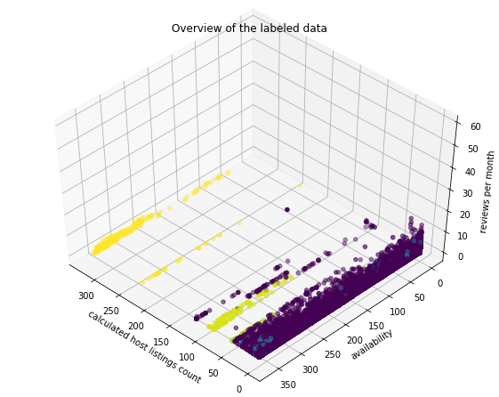

# Airbnb-NYC_Customer-Segmentation
Use the K-means and OPTICS algorithms to partition the databse of Airbnb users in New York City and identify suspicious users

# Introduction

Airbnb has quickly become the preferred choice for travelers around the world because of it's simplicity and flexibility. However, it's not only the customers the ones who are being benefited, but also the hosts. Further, there are times when hosts take advantage of this app and start running illegal businesses like hotels without paying the required taxes. That's why some people have attempted to find out who exactly could be running their businesses in this way.

In this project, I analyze Airbnb data from New York that I retrieved from http://insideairbnb.com/ and analyze the data to segment the customers in different groups according to their characteristics. For this project, I make use of Unsupervised Machine Learning algorithms, namely, K-Means and OPTICS Clustering

Finally, I perform data visualization in order to compare the characteristics of different groups and find if the availability of these listings is greater than the rest and if their prices are more accessible than the median.

## Overview of K-Means
The K-Means algorithm is an unsupervised Machine Learning approach to cluster data into different groups. 

In a subspace of N-dimensions, a K-Means algorithm will cluster the data in K groups. Each group will have a centroid and every data-point will be assigned to its closest centroid.

## Overview of OPTICS Clustering

Similar to K-Means, OPTICS is also an unsupervised Machine Learning algorithm. But different from it, OPTICS does not take an M number of clusters/groups, but rather asks for a minimum number of data-points in order to consider each group.

This algorithm is similar to DBSCAN but is slightly more complex.

# Methodology

The data was retrieved on May of 2019.

It consists of 38843 data-points and contains data from users in Manhattan, Brooklyn, Queens, Bronx, and Staten Island. The dominant regions are Manhattan and Brooklyn, while Staten Island has only a few hundred users.

To perform the data analysis, I choose 5 features to perform the data analysis, namely:

• Room Type - T_{x}

• Price - P_{x}

• Reviews per month - R_{x}

• Calculated Host Listings - L_{x} 

• Availability - A_{x}

I decided not to use geographical information such as location and neighborhood since those cold produce biased results. In order to find the right K for K-Means, I used the Elbow method, which turned out to give the value K=6.

Since the room type T_{x} was originally a non-numerical variable, I mapped it to turn it numerical. Afterwards, all these variables were re-scaled using scikit learn's StandardScaler. And then this new matrix $A$ of features is passed to the K-Means and OPTICS algorithm. So finally each data-point is mapped to a group A and a group B.

# Results

The resulting groups are shown in Tables 1 and 2. Those groups A were produced by K-Means and groups B were produced by OPTICS.

By looking at Figure 1(a), one can observe that some elements could actually belong to the same group, but due to the limitations of K-Means, they were clustered in different groups. Figure 1(b) shows the groups given by OPTICS, however most of the elements don't belong to any group, but Figure 2 shows only those groups produced by OPTICS that belong to some group.

It can be observed that both methods agree on one group, Group A6 and Group B16 are the exact same. Which turns out to be a very suspicious group since their Avg. number of host listings is significantly higher than the rest of the groups.

Table 1: Groups A
<table style="width:100%">
  <tr>
    <th>Group</th>
    <th>Avg. Price</th>
    <th>Avg. Reviews per month</th>
    <th>Avg. Calculated host listings count</th>
    <th>Avg. Availability (out of 365 days)</th>
  </tr>
  <tr>
    <th>1</th>
    <th>$77.39</th>
    <th>0.83</th>
    <th>2.00</th>
    <th>41.43</th>
  </tr>
  <tr>
    <th>2</th>
    <th>$162.10</th>
    <th>1.15</th>
    <th>7.94</th>
    <th>308.22</th>
  </tr>
  <tr>
    <th>3</th>
    <th>$127.02</th>
    <th>4.78</th>
    <th>2.08</th>
    <th>145.38</th>
  </tr>
  <tr>
    <th>4</th>
    <th>$271.96</th>
    <th>1.72</th>
    <th>315.68</th>
    <th>286.34</th>
  </tr>
  <tr>
    <th>5</th>
    <th>$182.28</th>
    <th>0.73</th>
    <th>1.68</th>
    <th>34.36</th>
  </tr>
  <tr>
    <th>6</th>
    <th>$6439.50</th>
    <th>0.59</th>
    <th>2.89</th>
    <th>185.61</th>
  </tr>
</table>

Table 2: Groups B
<table style="width:100%">
  <tr>
    <th>Group</th>
    <th>Avg. Price</th>
    <th>Avg. Reviews per month</th>
    <th>Avg. Calculated host listings count</th>
    <th>Avg. Availability (out of 365 days)</th>
  </tr>
  <tr>
    <th>1</th>
    <th>$49.64</th>
    <th>0.04</th>
    <th>1.00</th>
    <th>0.00</th>
  </tr>
  <tr>
    <th>2</th>
    <th>$39.55</th>
    <th>0.03</th>
    <th>1.00</th>
    <th>0.00/th>
  </tr>
  <tr>
    <th>3</th>
    <th>$60.09</th>
    <th>0.04</th>
    <th>1.00</th>
    <th>0.00</th>
  </tr>
  <tr>
    <th>4</th>
    <th>$79.83</th>
    <th>0.03</th>
    <th>1.00</th>
    <th>0.00</th>
  </tr>
  <tr>
    <th>5</th>
    <th>$99.17</th>
    <th>0.04</th>
    <th>1.00</th>
    <th>0.00</th>
  </tr>
  <tr>
    <th>6</th>
    <th>$57.16</th>
    <th>1.42</th>
    <th>4.77</th>
    <th>165.87</th>
  </tr>
  <tr>
    <th>7</th>
    <th>$99.26</th>
    <th>0.03</th>
    <th>1.00</th>
    <th>0.00</th>
  </tr>
  
  <tr>
    <th>8</th>
    <th>$122.45</th>
    <th>0.04</th>
    <th>1.00</th>
    <th>0.00</th>
  </tr>
  <tr>
    <th>9</th>
    <th>$149.88</th>
    <th>0.02</th>
    <th>1.00</th>
    <th>0.00</th>
  </tr>
  <tr>
    <th>10</th>
    <th>$176.44</th>
    <th>0.05</th>
    <th>1.00</th>
    <th>0.02</th>
  </tr>
  <tr>
    <th>11</th>
    <th>$199.16</th>
    <th>0.08</th>
    <th>1.00</th>
    <th>0.11</th>
  </tr>
    <tr>
    <th>12</th>
    <th>$224.97</th>
    <th>0.06</th>
    <th>1.04</th>
    <th>0.05</th>
  </tr>
  <tr>
    <th>13</th>
    <th>$249.77</th>
    <th>0.07</th>
    <th>1.00</th>
    <th>0.00</th>
  </tr>
  <tr>
    <th>14</th>
    <th>$141.40</th>
    <th>0.11</th>
    <th>51.31</th>
    <th>343.32</th>
  </tr>
  <tr>
    <th>15</th>
    <th>$181.95</th>
    <th>0.20</th>
    <th>92.55</th>
    <th>314.19</th>
  </tr>
  <tr>
    <th>16</th>
    <th>$271.96</th>
    <th>1.71</th>
    <th>315.68</th>
    <th>286.34</th>
  </tr>
</table>

# Which Airbnbs are suspicious?

As previously discussed, the most suspicious group is Group A4 or B16 (is the exact same in both tables) and the reason for that is the Avg. number of listings, which is the number of rooms/apartments/etc... that they offer, is significantly higher than the rest of the groups, furthermore, the rooms are available during most of the year. This is very striking because those are characteristics of a Hotel, which suggests that this could potentially be a group of customers running Hotels via Airbnb.

There are other two groups that look highly suspicious, those are Groups B14 and B15, since they have more than 50 listings on average and they are also open during more of the year, almost all of it.

Another suspicious group is Group A2, this is since the Avg. number of host listings is about 8, which is also higher than what is found in the rest of the groups of Table 1.

Finally, another slightly suspicious group can be found in Table 2, Group B6 has an average of 4.77 host listings which is still higher than what can be found in the rest of the groups in Table 2.

# Which Airbnbs are more accessible?

After looking at the different groups generated by the algorithms, I was trying to find if those suspicious users offer more accessible prices since they run their listings as a business.

After an examination, it was clear that Group A4/B16 was not more accessible than the rest. By looking at the groups in Table 1, such group was the second most expensive group of all, and by comparing it to those in Table 2 it could also be observed that such group is one of the most expensive ones.

# Which Airbnb are avaiable most of the time?

Finally, I attempted to find if the relationship of the different groups with their availability.

By looking at the average number of available days in a year, it can be observed that users in Group A4/B16 are available during most of the year (286.34 days), similarly are Groups B14 and B15 (343.32 and 314.19 days) as well as those in Group A2 (308.21 days) and Group B6 (165.87 days).

In general there's a correlation between the Avg. number of host listings and the Avg. availability since a high/low number of host listings corresponds to a high/low availability.

# Conclusion

This data analysis of Airbnb users in New York gives insightful information about how these are using the app, and what are some of the characteristics of the groups of users that use this app.

I identified 3 highly suspicious groups in the dataset and 2 others that are slightly suspicious. Nonetheless, there could be overlapping users in some of these groups, so it would be better to just stick with one single Machine Learning method for customer segmentation.

Finally, there are some limitations of this study, one is that the K-Means algorithm does not perform as well in every kind of data, so it should be better to stick with OPTICS or use another alternative like DBSCAN or manually label data and use supervised Machine Learning algorithms. Another one is that this study only applies to NY city, therefore, suspicious groups in other regions could look very different. And lastly, it could be possible to make some sort of sentiment analysis to analyze the comments and find more insightful information.
